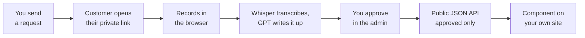

# Debrief

**Testimonials that fill themselves.**

[](https://github.com/anurieli/debrief/stargazers)
[](https://github.com/anurieli/debrief/forks)
[](LICENSE)

Debrief is a self-hosted, automated testimonial system. Send a link, your customer records a video, AI writes the testimonial, you approve it, it renders on your site. You deploy one instance, it exposes a public read-only API, and you copy a component into your own codebase that reads from it. Your content, your database, your domain.

The premise is simple: almost nobody will write you three good paragraphs, but almost everybody will talk to their phone for ninety seconds. So Debrief asks for a video and does the writing itself.

**Live demo:** [debrief-demo.vercel.app](https://debrief-demo.vercel.app), running in demo mode on in-memory data. The [admin](https://debrief-demo.vercel.app/admin) is open, no sign-in; go ahead and approve or delete things, it resets itself.

<p align="center">
  
</p>

---

## Install it in one conversation

You should not have to read this README to use this. Paste the block below into Claude Code, Cursor, Codex, or whatever agent you already have open in your project, and answer its questions.

```
Set up Debrief testimonials in this project.

Read https://raw.githubusercontent.com/anurieli/debrief/main/CLAUDE.md and follow
the "Job A" instructions in it exactly, including the interview step before you
write any code.

Repo: https://github.com/anurieli/debrief
Live demo: https://debrief-demo.vercel.app

Do all of it in this one conversation: ask me where testimonials belong, copy the
components in, restyle them to match this codebase, wire the env var, and tell me
what to do if I don't have an instance deployed yet. Ask me whenever you're not
sure instead of guessing.
```

Here is what that agent does, so there are no surprises:

1. **Asks you where testimonials belong.** Under the pricing table, above the footer, a dedicated `/testimonials` page. It will not guess and scatter them.
2. **Finds your landing page itself.** It reads your routing and file layout, so you do not have to explain where anything lives.
3. **Copies in the component and restyles it.** `components/debrief/` has no imports from this repo, which is what makes pasting it into a stranger's codebase work. The agent then matches your border radius, spacing, fonts, and dark mode, so it does not look bolted on.
4. **Wires the connection.** One env var, `NEXT_PUBLIC_DEBRIEF_URL`, pointing at your instance. If you have not deployed one yet, it walks you through that first, including the database, which is one command.
5. **Asks when it does not know.** Which categories go on which page, compact strip or full wall, both. The interview is a required step in `CLAUDE.md`, not a suggestion.

The whole thing is three files and one env var on your side. There is no package to install and no version to keep in step.

Prefer to do it by hand? [Skip to the manual version](#putting-testimonials-on-your-site).

---

## How it works



Two of those steps need you: sending the request and approving the result. Everything between them is automatic. The customer never makes an account, never installs anything, and never waits on the transcription, which runs after their page has already said thank you.

The write-up is three short paragraphs in the customer's own words: the situation before, what changed, and who they would recommend you to. There is a text mode too, for people who prefer typing.

Two details worth knowing:

- **Only people you asked can submit.** Every request carries a private token in its link, and by default that token is required: no token means no upload slot and no submission. Set `inviteOnly: false` if you would rather run a permanently open "leave us a testimonial" page. Submissions carrying a valid token also get a **verified** flag.
- Unanswered requests get one automatic nudge after seven days, then Debrief leaves them alone. The counter only advances when the email actually sends, so a mail outage cannot silently burn everyone's single follow-up.

---

## Quick start

```bash
git clone https://github.com/anurieli/debrief.git
cd debrief
npm install
npm run dev
```

Open `http://localhost:3000`. **It works immediately with no configuration.** No database, no API keys, no accounts. It runs on in-memory demo data, so you can send a request, open the recording page, approve a testimonial, and watch the component update, all before deciding whether you want any of it. Nothing persists until you add a database.

Then make it yours by editing one file, `debrief.config.ts`:

```ts
export const debriefConfig: DebriefConfig = {
  brandName: 'Acme',
  senderName: 'Alex',
  categories: [{ value: 'consulting', label: 'Consulting' }],
  questions: {
    before: 'What was the situation before we worked together?',
    after: 'What changed after?',
    recommend: 'Would you recommend us, and to whom?',
  },
  recordingPage: {
    eyebrow: 'Customer testimonial',
    title: 'Share your experience',
    intro: 'Two minutes. A short video works best, and one take covers all three questions.',
  },
  inviteOnly: true,   // only people you sent a link to can submit
  accent: '#4F46E5',
};
```

That drives the emails, the recording page, the admin, and the AI prompt. There is no other branding to find and replace. Set `categories` to `[]` and the whole concept disappears from the form.

---

## The three pages

There are only three, and `npm run dev` shows you all of them on demo data.

**`/submit`** is what your customer sees, and it only opens with the token from their own link. One question per screen, no scrolling, on a phone or a laptop. They record in the browser, or write it if they would rather type. The whole thing is four screens in video mode.

<p align="center">
  
</p>

**`/admin`** is the whole job in one screen. Three counts across the top, one view at a time: what is waiting on you, what is live, and who has not replied yet. Approving is one click, and so is changing your mind. Asking someone new is a button, not a form you scroll past every time.

<p align="center">
  
</p>

**`/`** is the instance's own front page, with the component rendering live below it, reading from the same instance you are looking at. Delete the file if you would rather the instance had no public homepage.

<p align="center">
  
</p>

---

## Putting testimonials on your site

Copy `components/debrief/` into your own project, point it at your instance, and render it.

```bash
NEXT_PUBLIC_DEBRIEF_URL=https://testimonials.yourdomain.com
```

```tsx
import TestimonialStrip from '@/components/debrief/TestimonialStrip';

<TestimonialStrip limit={3} heading="What people say" />
```

```tsx
import TestimonialWall from '@/components/debrief/TestimonialWall';

<TestimonialWall />  // full stories with video, for a /testimonials page
```

That is the whole integration. Three files, one env var, no package to install and no version to keep in step.

The components are async server components for the Next.js App Router, with zero imports from the rest of this repo, which is why pasting them into a stranger's codebase works. They are plain Tailwind, so restyle them, rename them, tear them apart. They render `null` when there are no approved testimonials, so you can place them before you have collected any. For a client component tree or a non-Next app, call `fetchTestimonials()` from `debrief-client.ts` yourself and pass the result in via the `testimonials` prop.

**Working with an AI assistant?** This repo ships a [`CLAUDE.md`](CLAUDE.md) written for coding agents. Point Claude Code (or any agent) at it and say *"install Debrief components into this site"*. It will read the contract, interview you about where the testimonials belong, and restyle them to match the site it is working in.

If you would rather not copy components, read the API directly:

```
GET https://your-instance/api/public/testimonials?category=consulting&limit=6&featured=true
```

Approved testimonials only, no email addresses, CORS open. The response shape is a whitelist in `lib/public-shape.ts`, so adding a column to the database does not quietly publish it.

---

## Going live

Deploy to Vercel (or anywhere that runs Next.js), then set what you need. Every service is optional and degrades honestly rather than crashing, and the app says in plain words what is currently switched off: a banner in the admin for demo mode, a missing password, or missing AI, and one on the recording page when video upload is unavailable.

| Variable | Without it |
|---|---|
| `NEXT_PUBLIC_APP_URL` | Recording links are built against `http://localhost:3000`. Set it before you email anyone. |
| `DATABASE_URL` | Runs on in-memory demo data. Any Postgres works: Neon, Supabase, RDS, local. |
| `BLOB_READ_WRITE_TOKEN` | Video upload is disabled and the recording page switches to text mode. |
| `ADMIN_PASSWORD` | Admin page is open in dev and in demo mode, and locked entirely in a production deploy that has a database. The admin API is switched off, since this doubles as its bearer token. |
| `RESEND_API_KEY` + `EMAIL_FROM` | Requests are still created, the admin just hands you the link to send yourself. |
| `EMAIL_NOTIFY` | No email when a testimonial lands. You find it in the admin instead. |
| `OPENAI_API_KEY` | Videos are stored and playable, but not transcribed or written up. |
| `CRON_SECRET` | The nudge endpoint is unauthenticated. Set it. |

With a real database, apply the schema once:

```bash
npm run db:setup
```

It reads `DATABASE_URL` from `.env.local` (or the environment) and runs [`lib/db/schema.sql`](lib/db/schema.sql), which is the entire data model: two tables, plain SQL, safe to re-run.

The seven-day nudge runs off a daily cron. `vercel.json` already declares it, so on Vercel there is nothing to wire. Anywhere else, hit `GET /api/cron/nudges` once a day with `Authorization: Bearer $CRON_SECRET`.

---

## Wiring it to your CRM

The admin has a form, but the way Debrief is meant to be used is from whatever system already knows a project just closed. Three endpoints, and that is the entire integration surface.

| | Endpoint | Auth | What it is for |
|---|---|---|---|
| **Ask** | `POST /api/requests` | Bearer | Fire this on your project-closed event. |
| **Track** | `GET /api/requests` | Bearer | Who you have asked, and where each one stands. |
| **Show** | `GET /api/public/testimonials` | None | What came back and got approved. This is what your site reads. |

Bearer auth is `Authorization: Bearer $ADMIN_PASSWORD`, always, with no exceptions for dev or demo mode. If `ADMIN_PASSWORD` is unset the two bearer endpoints are switched off entirely, because there is nothing to check against.

**Ask.** One call, safe to wire blindly:

```bash
curl -X POST https://your-instance/api/requests \
  -H "Authorization: Bearer $ADMIN_PASSWORD" \
  -H "Content-Type: application/json" \
  -d '{"email":"jane@acme.com","name":"Jane","category":"consulting","customMessage":"Loved building the rollout with you."}'
```

- **Idempotent.** One open request per email. If your CRM double-fires the webhook, the second call returns the existing request instead of emailing your customer twice.
- **The follow-up is handled.** One automatic nudge after seven days, then it stops. You never chase anyone.
- **It always answers with the recording link,** whether or not the email went out, so an unconfigured mailer degrades to you sending the link yourself.

**Track.** The other half, and the one that makes this a loop rather than a fire-and-forget:

```bash
curl https://your-instance/api/requests -H "Authorization: Bearer $ADMIN_PASSWORD"
```

```json
{
  "requests": [
    { "id": "...", "email": "jane@acme.com", "name": "Jane",
      "status": "pending", "sentAt": "2026-07-22T09:00:00.000Z", "resendCount": 0 },
    { "id": "...", "email": "tom@fieldstone.co", "name": "Tom",
      "status": "completed", "sentAt": "2026-07-09T09:00:00.000Z", "resendCount": 1 }
  ]
}
```

`status` is `pending`, `completed`, or `cancelled`. Poll it and your CRM can show, next to each client, whether they have been asked, whether they answered, and whether they have already used up their one nudge. That is what stops you asking the same person twice from two different systems.

**Where the line sits.** Debrief does not know your roster and does not try to. Your CRM knows who your clients are, what you delivered, and where they sit in your pipeline; Debrief knows who has been asked and what came back. Deciding *who* deserves a request is your CRM's job, and `GET /api/requests` is what it needs to make that call without guessing.

Hook the ask to your project-closed event, read the track endpoint wherever you look at clients, and testimonial collection stops being something you remember to do.

> The public read is deliberately open. It is approved-only and strips email addresses, so do not put auth in front of it or proxy it "for security". It is already the safe surface. The two bearer endpoints are the ones that expose email, and they stay closed even in demo mode.

---

## This is v1, and small on purpose

Debrief collects video testimonials, turns them into text, gates them behind your approval, and serves them to your site. That loop works end to end today, including the parts that usually break: recording on a phone, uploading a 100MB file, and rendering on a site that knows nothing about this repo.

No plan tiers, no widget builder, no dashboard of vanity metrics, and no hosted wall on someone else's domain. Every external dependency is isolated to one file so you can replace it: email in `lib/email.ts`, AI in `lib/ai.ts`, the database behind `lib/store.ts`, storage in `app/api/upload/route.ts`. The whole thing is short enough to read in an afternoon and change in an hour.

The scope below is chosen, not missing by accident. **Not in v1, and on the list:**

- One shared admin password rather than user accounts. Fine for one approver, not for a team with roles.
- Vercel Blob is the only storage adapter shipped. S3 or R2 means rewriting the upload route and the one call site that uses it (see [Swapping a provider](CLAUDE.md#swapping-a-provider)).
- Resend for email and OpenAI for transcription are likewise the only adapters shipped, each behind a single file.
- The AI prompt is written in English and produces English. Other languages are untested.
- The admin can approve, feature, and delete. It cannot edit the generated text, so a bad write-up is a delete and re-ask.
- Transcription cannot be re-run from the UI if it fails.
- No analytics, and no widget script for non-React sites. The JSON API is the answer for those, and it is a plain `fetch`.
- No test suite yet.

---

## Stack

Next.js 16 (App Router) · React 19 · TypeScript · Tailwind v4 · Postgres, plain SQL via postgres.js · Vercel Blob · Resend · OpenAI Whisper + GPT

---

## Contributing

Issues and pull requests are welcome. The most useful contributions are the ones that keep the project this size: bug fixes, a storage or email adapter behind the existing seam, better handling of a browser that records something strange. If you are planning something larger, open an issue first so we can agree on the shape before you write it.

[`CLAUDE.md`](CLAUDE.md) documents the invariants worth not breaking.

---

## License

MIT. Use it commercially, fork it, close-source your fork; just keep the copyright notice.
