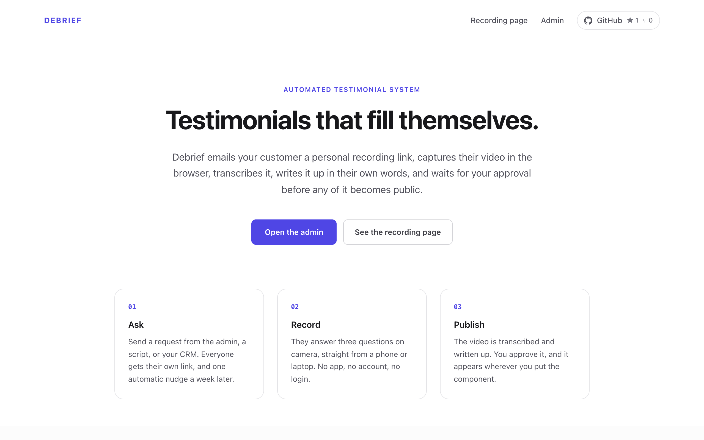
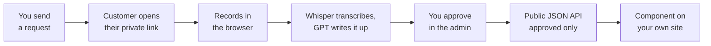
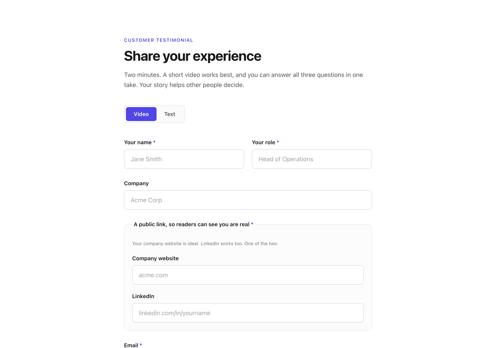
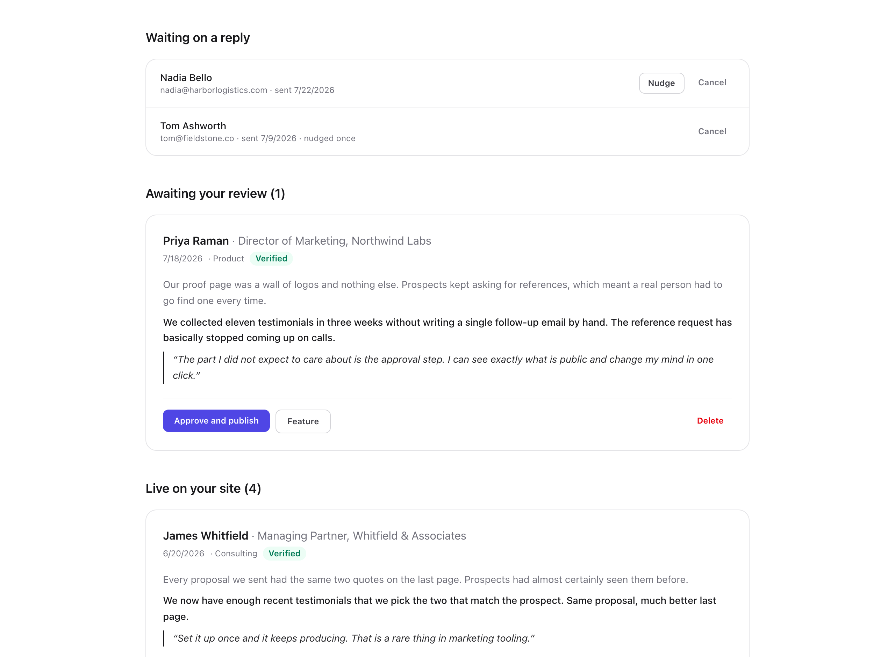
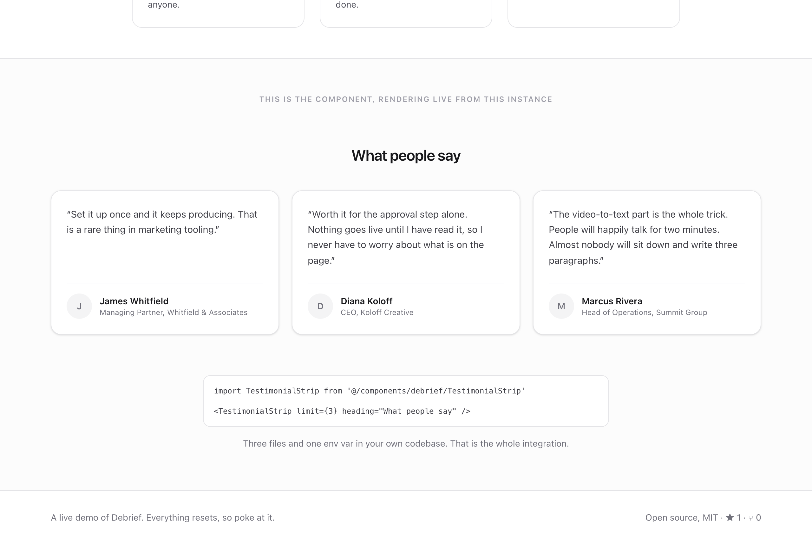

# Vouch

**Send a link. Your customer records a video. AI writes the testimonial. You approve it. It renders on your site.**

Vouch is a self-hosted testimonial engine. You deploy one instance, it exposes a public read-only API, and you copy a component into your own codebase that reads from it. Your content, your database, your domain.

<p align="center">
  
</p>

---

## This is v1

Vouch is small and finished at what it does. It collects video testimonials, turns them into text, gates them behind your approval, and serves them to your site. That loop works end to end today, including the parts that usually break: recording on a phone, uploading a 100MB file, and rendering on a site that knows nothing about this repo.

The scope below is chosen, not missing by accident. Each of these is a place where a general solution would have cost more than it returned at this size.

**Not in v1, and on the list:**

- One shared admin password rather than user accounts. Fine for one approver, not for a team with roles.
- Vercel Blob is the only storage adapter shipped. S3 or R2 means rewriting the upload route and the one call site that uses it (see [Swapping a provider](CLAUDE.md#swapping-a-provider)).
- Resend for email and OpenAI for transcription are likewise the only adapters shipped, each behind a single file.
- The AI prompt is written in English and produces English. Other languages are untested.
- The admin can approve, feature, and delete. It cannot edit the generated text, so a bad write-up is a delete and re-ask.
- Transcription cannot be re-run from the UI if it fails.
- No analytics, and no widget script for non-React sites. The JSON API is the answer for those, and it is a plain `fetch`.
- No test suite yet.

---

## How it works



Approval is the only step that asks anything of you. The customer never makes an account, never installs anything, and never waits on the transcription, which runs after their page has already said thank you.

---

## Why video, then text

Almost nobody will sit down and write you three good paragraphs. Almost everybody will talk to their phone for ninety seconds.

So Vouch asks for a video, transcribes it with Whisper, and rewrites it as three short paragraphs in the customer's own voice: the situation before, what changed, and who they would recommend you to. You get a testimonial you can put on a landing page and a video you can put next to it. The customer spent two minutes.

There is a text mode too, for the people who prefer typing.

---

## Quick start

```bash
git clone https://github.com/anurieli365/vouch.git
cd vouch
npm install
npm run dev
```

Open `http://localhost:3000`. **It works immediately with no configuration.** No database, no API keys, no accounts. It runs on in-memory demo data, so you can send a request, open the recording page, approve a testimonial, and watch the component update, all before deciding whether you want any of it. Nothing persists until you add a database.

Then make it yours by editing one file, `vouch.config.ts`:

```ts
export const vouchConfig: VouchConfig = {
  brandName: 'Acme',
  senderName: 'Alex',
  categories: [{ value: 'consulting', label: 'Consulting' }],
  questions: {
    before: 'What was the situation before we worked together?',
    after: 'What changed after?',
    recommend: 'Would you recommend us, and to whom?',
  },
  recordingPage: {
    eyebrow: 'Customer testimonial',
    title: 'Share your experience',
    intro: 'Two minutes. A short video works best, and one take covers all three questions.',
  },
  accent: '#4F46E5',
};
```

That drives the emails, the recording page, the admin, and the AI prompt. There is no other branding to find and replace. Set `categories` to `[]` and the whole concept disappears from the form.

---

## Putting testimonials on your site

Copy `components/vouch/` into your own project, point it at your instance, and render it.

```bash
NEXT_PUBLIC_VOUCH_URL=https://testimonials.yourdomain.com
```

```tsx
import TestimonialStrip from '@/components/vouch/TestimonialStrip';

<TestimonialStrip limit={3} heading="What people say" />
```

```tsx
import TestimonialWall from '@/components/vouch/TestimonialWall';

<TestimonialWall />  // full stories with video, for a /testimonials page
```

That is the whole integration. Three files, one env var, no package to install and no version to keep in step.

The components are async server components for the Next.js App Router, with zero imports from the rest of this repo, which is why pasting them into a stranger's codebase works. They are plain Tailwind, so restyle them, rename them, tear them apart. They render `null` when there are no approved testimonials, so you can place them before you have collected any. For a client component tree or a non-Next app, call `fetchTestimonials()` from `vouch-client.ts` yourself and pass the result in via the `testimonials` prop.

**Working with an AI assistant?** This repo ships a [`CLAUDE.md`](CLAUDE.md) written for coding agents. Point Claude Code (or any agent) at it and say *"install Vouch components into this site"*. It will read the contract, interview you about where the testimonials belong, and restyle them to match the site it is working in.

If you would rather not copy components, read the API directly:

```
GET https://your-instance/api/public/testimonials?category=consulting&limit=6&featured=true
```

Approved testimonials only, no email addresses, CORS open. The response shape is a whitelist in `lib/public-shape.ts`, so adding a column to the database does not quietly publish it.

---

## Where you would use this

**An agency or studio.** Fire a request from your CRM the moment a project is marked complete. Tag each one with a category so the retainer testimonials land on the retainer page and the one-off build testimonials land somewhere else.

**A SaaS company.** Send the request a few weeks after onboarding finishes, while the before-and-after is still fresh. Put `TestimonialStrip` under the pricing table and `TestimonialWall` on a dedicated page.

**A consultant or freelancer.** One instance on a subdomain, one component on the portfolio site. The verified flag distinguishes a real client who opened your link from anyone who found the public form.

**A course creator or online store.** Ask at the point people finish, when they are most likely to say yes, and let the wall page carry the video alongside the written version.

---

## The pipeline

| Stage | What happens |
|---|---|
| **Ask** | You send a request from the admin, a script, or your CRM. Each one gets a unique tokenised link. |
| **Record** | They open the link, answer three questions on camera, and the video uploads straight from their browser to blob storage. No account, no app. A file upload works too, for anyone whose camera refuses to cooperate. |
| **Process** | Whisper transcribes it. GPT rewrites it into three paragraphs, faithfully, without inventing anything. Both run in the background so the customer never waits. |
| **Approve** | Nothing is public until you flip one switch in the admin. |
| **Publish** | Approved testimonials appear on `/api/public/testimonials`, and the components you copied into your site render them. |

Submissions that match a request you sent get a **verified** flag, so you can tell a real customer from a stranger who found the form.

Unanswered requests get one automatic nudge after seven days, and then Vouch leaves them alone. The counter only advances when the email actually sends, so a mail outage cannot silently burn everyone's single follow-up. There is a manual **Nudge** button in the admin for the same request if you would rather choose the moment.

---

## The three pages

There are only three, and `npm run dev` shows you all of them on demo data.

**`/submit`** is what your customer sees. Pick video or text, fill in who you are, then record in the browser.

<p align="center">
  
</p>

**`/admin`** is the whole job in one screen: who has not replied yet, what is waiting on you, and what is currently live. Approving is one click, and so is changing your mind.

<p align="center">
  
</p>

**`/`** is the instance's own front page, with the component rendering live below it, reading from the same instance you are looking at. Delete the file if you would rather the instance had no public homepage.

<p align="center">
  
</p>

---

## Going live

Deploy to Vercel (or anywhere that runs Next.js), then set what you need. Every service is optional and degrades honestly rather than crashing, and the app says in plain words what is currently switched off: a banner in the admin for demo mode, a missing password, or missing AI, and one on the recording page when video upload is unavailable.

| Variable | Without it |
|---|---|
| `NEXT_PUBLIC_APP_URL` | Recording links are built against `http://localhost:3000`. Set it before you email anyone. |
| `DATABASE_URL` | Runs on in-memory demo data. Any Postgres works: Neon, Supabase, RDS, local. |
| `BLOB_READ_WRITE_TOKEN` | Video upload is disabled and the recording page switches to text mode. |
| `ADMIN_PASSWORD` | Admin is open in dev, locked entirely in production. |
| `RESEND_API_KEY` + `EMAIL_FROM` | Requests are still created, the admin just hands you the link to send yourself. |
| `EMAIL_NOTIFY` | No email when a testimonial lands. You find it in the admin instead. |
| `OPENAI_API_KEY` | Videos are stored and playable, but not transcribed or written up. |
| `CRON_SECRET` | The nudge endpoint is unauthenticated. Set it. |

With a real database, push the schema once:

```bash
npm run db:push
```

The seven-day nudge runs off a daily cron. `vercel.json` already declares it, so on Vercel there is nothing to wire. Anywhere else, hit `GET /api/cron/nudges` once a day with `Authorization: Bearer $CRON_SECRET`.

---

## Sending requests programmatically

The admin has a form, but anything can send a request:

```bash
curl -X POST https://your-instance/api/requests \
  -H "Authorization: Bearer $ADMIN_PASSWORD" \
  -H "Content-Type: application/json" \
  -d '{"email":"jane@acme.com","name":"Jane","customMessage":"Loved building the rollout with you."}'
```

It responds with the request id and the recording link, whether or not the email went out. Hook it to the moment a project closes in your CRM and testimonial collection stops being something you remember to do.

---

## What is deliberately not here

Vouch is small on purpose. No plan tiers, no widget builder, no dashboard of vanity metrics, and no hosted wall on someone else's domain. Every external dependency is isolated to one file so you can replace it: email in `lib/email.ts`, AI in `lib/ai.ts`, the database behind `lib/store.ts`, storage in `app/api/upload/route.ts`. The whole thing is short enough to read in an afternoon and change in an hour.

---

## Stack

Next.js 16 (App Router) · React 19 · TypeScript · Tailwind v4 · Drizzle + Postgres · Vercel Blob · Resend · OpenAI Whisper + GPT

---

## Contributing

Issues and pull requests are welcome. The most useful contributions are the ones that keep the project this size: bug fixes, a storage or email adapter behind the existing seam, better handling of a browser that records something strange. If you are planning something larger, open an issue first so we can agree on the shape before you write it.

[`CLAUDE.md`](CLAUDE.md) documents the invariants worth not breaking.

---

## License

MIT. Use it commercially, fork it, close-source your fork; just keep the copyright notice.
